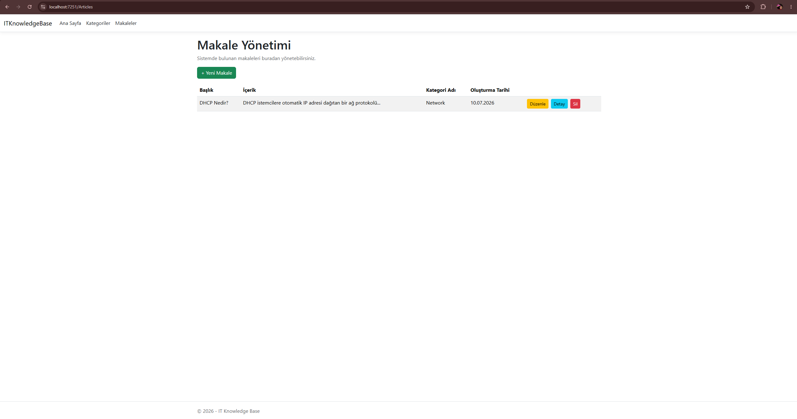

# 📚 IT Knowledge Base

A modern **IT Knowledge Base** application developed with **ASP.NET Core MVC**, **Entity Framework Core**, and **PostgreSQL**. The project enables users to manage IT categories and articles through a clean and responsive web interface.

---

## 🚀 Features

- 📂 Category Management (Create, Read, Update, Delete)
- 📝 Article Management (Create, Read, Update, Delete)
- 🔗 One-to-Many relationship between Categories and Articles
- 📄 Article Details page
- 🎨 Responsive Bootstrap 5 interface
- 🗄️ PostgreSQL database integration
- ✔️ Entity Framework Core Code First approach

---

## 🛠️ Technologies

- ASP.NET Core MVC
- C#
- Entity Framework Core
- PostgreSQL
- Bootstrap 5
- HTML5
- CSS3
- Git & GitHub

---

## 📸 Screenshots

### 🏠 Home


---

### 📂 Category Management


---

### 📝 Article Management



---

### 📖 Article Details


---

## 📂 Project Structure

```text
ITKnowledgeBase
│
├── Controllers
├── Models
├── Views
├── Data
├── Migrations
├── Images
├── wwwroot
├── Program.cs
└── README.md
```

---

## ⚙️ Installation

Clone the repository:

```bash
git clone https://github.com/Talhasen61/ITKnowledgeBase.git
```

Open the project with Visual Studio.

Update your PostgreSQL connection string inside **appsettings.json**.

Run the following command:

```powershell
Update-Database
```

Run the project.

---

## 🎯 What I Learned

During this project I practiced:

- ASP.NET Core MVC Architecture
- Entity Framework Core
- CRUD Operations
- One-to-Many Relationships
- Razor Views
- PostgreSQL
- Bootstrap
- Git & GitHub Workflow

---

## 🔮 Future Improvements

- 🔐 User Authentication & Authorization
- 🔍 Search Functionality
- 📄 Pagination
- 📊 Dashboard
- 🏷️ Tags for Articles
- 📎 File Attachments

---

## 👨‍💻 Developer

**Talha Şen**

GitHub: https://github.com/Talhasen61

---

⭐ If you like this project, don't forget to give it a star.